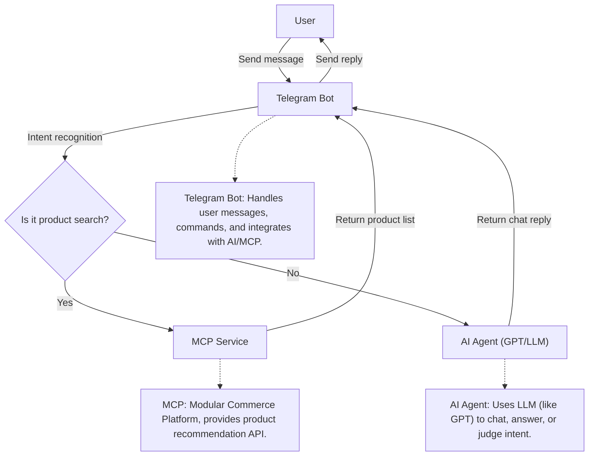

# Telegram Agent Bot

## Project Purpose

This repository provides an open-source, extensible example of a modern Telegram bot for product recommendation and intelligent conversation. It is designed for developers and beginners who want to:

- Learn how to build a Telegram bot that combines product recommendation, AI-powered chat, and tool/plugin invocation
- Integrate large language models (LLMs) and external APIs using the Model Context Protocol (MCP)
- Explore best practices in code structure, internationalization, environment variable management, and open-source development
- Quickly adapt, extend, or integrate the bot for their own projects, commercial use, or as a reference for building AI-powered assistants

**Key features:**

- Open source, well-documented, and PEP8-compliant codebase
- Plugin-ready: easily add new tools, APIs, or LLM providers
- Supports multi-turn conversation, intent recognition, and rich product messages
- Internationalization-friendly and easy to localize
- Ideal for learning, rapid prototyping, and production integration

## Keywords & Use Cases

This repository is ideal for anyone interested in:

- Building a Telegram bot for e-commerce, product recommendation, or shopping assistance
- Creating an AI chatbot or conversational AI assistant using Python and async frameworks
- Integrating large language models (LLMs) such as OpenAI, Monica, or custom providers
- Implementing plugin systems, tool calling, and function-calling workflows (RAG, agent, automation)
- Managing multi-turn dialogue, user context, and memory in chatbots
- Developing customer support bots, marketplace bots, or intelligent shopping assistants
- Learning best practices for open source, scalable, and developer-friendly bot architectures
- Using MCP (Model Context Protocol) for unified API and tool integration
- Rapid prototyping, template projects, and production-ready starter kits for AI-powered bots

**Keywords:** Telegram bot, AI chatbot, product recommendation, e-commerce, LLM, OpenAI, Monica, plugin, tool calling, context management, Python, async, open source, multi-turn dialogue, agent, automation, RAG, function calling, integration, best practices, template, starter, marketplace, customer support, shopping bot, conversational AI, API integration, extensible, scalable, developer-friendly, MCP, fastmcp, tool registration, plugin ecosystem, chat agent, memory, context, API orchestration.

---

## Basic Concepts

### 1. Telegram Bot

Telegram Bot is an automated program that interacts with users in Telegram chats, handling messages, commands, sending rich text, images, buttons, etc. It communicates with users via the official Telegram API.

### 2. AI Agent

AI Agent usually refers to an intelligent module integrated with large language models (such as GPT, Monica, OpenAI, etc.). It can understand user intent, conduct natural language conversations, Q&A, and even judge user needs (e.g., whether to recommend products).

### 3. MCP (Model Context Protocol)

**MCP (Model Context Protocol)** is an open, universal protocol designed for the AI era. Its primary goal is to standardize and simplify the way developers interact with large language models (LLMs), AI tools, and multi-turn conversational agents. MCP provides a unified interface for model service invocation, tool registration, context management, and plugin extension, enabling seamless integration and orchestration of diverse AI capabilities.

### Key Concepts and Features of MCP

- **Unified Model Invocation:** Call any LLM (e.g., OpenAI, local models, Monica, etc.) or AI service through a standard protocol, regardless of vendor or backend.
- **Tool Registration:** Register custom tools (functions, APIs, plugins) that can be called by the model or orchestrator, enabling function-calling, retrieval-augmented generation (RAG), and agentic workflows.
- **Context Management:** Maintain and manage multi-turn conversation context, user state, and tool outputs, supporting advanced dialogue and memory.
- **Plugin/Tool Ecosystem:** Easily extend LLMs with external plugins, APIs, or business logic, allowing for composable and modular AI applications.
- **Multi-Model & Multi-Tool Collaboration:** Coordinate multiple models and tools in a single workflow, supporting complex agent and automation scenarios.
- **Standardized Protocol:** Decouple application logic from specific LLM providers or tool implementations, making AI systems more portable and maintainable.

### Example Use Cases

- **AI Chatbots & Agents:** Build bots that can chat, answer questions, and invoke external tools (e.g., search, product recommendation, order tracking) in a unified way.
- **Intelligent Assistants:** Integrate LLMs with business APIs, databases, or custom logic for advanced automation and decision support.
- **Plugin-Enabled LLM Apps:** Allow users or developers to register new tools/plugins at runtime, instantly expanding the agent's capabilities.
- **Multi-Turn Dialogue Systems:** Manage conversation history, user profiles, and context for personalized, coherent interactions.

### What is fastmcp?

**fastmcp** is the most popular and production-ready Python implementation of the MCP protocol. It provides:

- **High-performance async server and client** for scalable, concurrent AI applications
- **Minimalist tool registration**: register any Python function or API as a tool in seconds
- **Automatic OpenAPI/JSON schema generation** for tool interfaces
- **Auto-generated Python/JS clients** for easy integration
- **Rich context and memory management** for advanced agent workflows
- **Extensive plugin and extension support**
- **Battle-tested in real-world AI bots, assistants, and automation systems**

#### Example: Unified Tool Calling

With MCP/fastmcp, you can register a Python function as a tool:

```python
from fastmcp import MCPServer

server = MCPServer()

@server.tool()
def get_weather(city: str) -> str:
    """Get the weather for a city."""
    # ... call weather API ...
    return f"The weather in {city} is sunny."
```

Now, any LLM or agent connected via MCP can call `get_weather` as a tool, and the protocol will handle input/output, context, and error management automatically.

### Ecosystem and Community

- **Website:** [gofastmcp.com](https://gofastmcp.com)
- **GitHub:** [jlowin/fastmcp](https://github.com/jlowin/fastmcp)
- **Open source, growing plugin ecosystem, and active developer community**

MCP and fastmcp are ideal for building next-generation AI bots, assistants, automation tools, and plugin-enabled LLM applications. They empower developers to create flexible, extensible, and future-proof AI systems with minimal friction.

---

## Workflow Diagram



---

A Telegram bot for product recommendation and intelligent chat, supporting multi-LLM provider, internationalization, and open source best practices.

## Features

- Product recommendation via MCP service
- Intelligent intent recognition (recommendation vs. chat)
- Multi-provider LLM support (monica/openai/mcp)
- All configuration via environment variables
- Internationalization: English code, bilingual comments
- Structured product rich text and inline buttons
- Complete unit tests
- Open source best practices: PEP8, docs, requirements, setup, .env example

## Directory Structure

```
.
├── handlers/                  # Message and command handlers
│   ├── commands.py
│   └── message.py
├── client.py                  # MCP client wrapper
├── gpt_service.py             # GPT service wrapper
├── utils/                     # Utility modules
│   ├── context.py
│   └── logging.py
├── main.py                    # Entry point
├── requirements.txt           # Dependencies
├── .env                       # Environment variables
├── .gitignore
├── README.md                  # English documentation
├── README_zh.md               # Chinese documentation
└── tests/                     # Unit tests
    └── test_basic.py
```

## Quick Start

We recommend using [uv](https://github.com/astral-sh/uv) for fast, modern Python dependency management and virtual environments.

1. Install uv (if not already):
   ```bash
   pip install uv
   # or
   pipx install uv
   ```
2. Create and activate a virtual environment:
   ```bash
   uv venv .venv
   # Windows
   .venv\Scripts\activate
   # macOS/Linux
   source .venv/bin/activate
   ```
3. Install dependencies:
   ```bash
   uv pip install -r requirements.txt
   ```
4. Start the bot:
   ```bash
   uv run client.py
   ```

Alternatively, you can use standard pip and python if you prefer.

## Environment Variables

See `.env.example` for all required variables. The most important environment variables are:

- `TELEGRAM_TOKEN` - Telegram Bot Token
- `MCP_SERVER_URL` - MCP service endpoint URL
- `SHOP_URL` - Shop page URL
- `SERVICE_URL` - Customer service URL
- `SERVICE_USERNAME` - Customer service username
- `POLICY_URL` - Privacy policy URL
- `LLM_PROVIDER` - LLM provider (e.g., `monica`, `openai`)
- `MONICA_API_KEY` - Monica API key (if using Monica)
- `OPENAI_API_KEY` - OpenAI API key (if using OpenAI)
- `OPENAI_MODEL` - OpenAI model name (default: `gpt-4o`)
- `ASSETS_URL_PREFIX` - Asset (image) URL prefix
- `PROXY_URL` - Proxy URL (if needed)

You can copy `.env.example` to `.env` and fill in your own values.

## Commands

- `/start` - Start the bot
- `/shop` - Browse products
- `/trackorder` - Track your order
- `/help` - Help
- `/contact` - Contact service
- `/language` - Switch language
- `/policy` - Privacy policy
- `/feedback` - Feedback

## Example


## Contributing

Pull requests are welcome!

## License

MIT

## Acknowledgement

Thanks to all contributors and the open source community!
