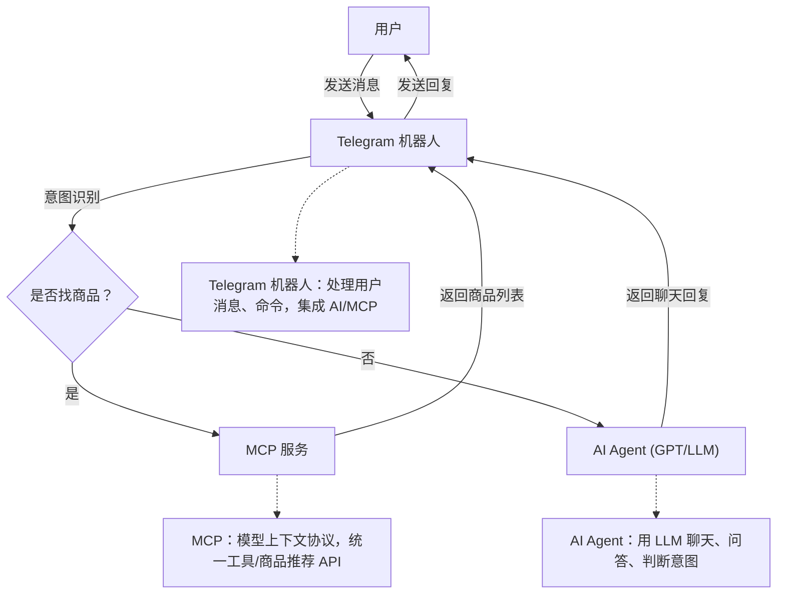
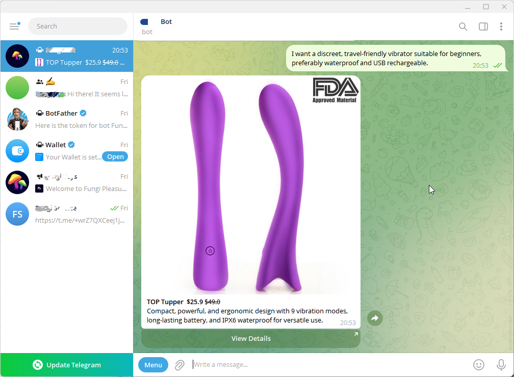

<p align="right">
  <a href="README.md">English</a> | <b>简体中文</b>
</p>

# Telegram Agent Bot

## 项目目的

本仓库旨在为开发者和初学者提供一个开源、可扩展的现代 Telegram 商品推荐与智能对话机器人示例。适用于：

- 学习如何构建结合商品推荐、AI 智能对话、工具/插件调用的 Telegram 机器人
- 集成大语言模型（LLM）与外部 API，采用 Model Context Protocol (MCP) 实现统一调用
- 探索代码结构、国际化、环境变量管理、开源开发等最佳实践
- 快速适配、扩展或集成到自己的项目、商业应用，或作为 AI 助手开发参考

**核心特性：**

- 开源、文档完善、符合 PEP8 规范
- 插件化设计，便于扩展新工具、API 或 LLM 服务商
- 支持多轮对话、意图识别、结构化商品富文本消息
- 友好的国际化和本地化支持
- 适合学习、原型开发和生产集成

---

## 关键词与应用场景

本项目适用于：

- 构建电商、商品推荐、购物助手类 Telegram 机器人
- 使用 Python 和异步框架开发 AI 聊天机器人或对话式 AI 助手
- 集成 OpenAI、Monica 等大语言模型或自定义 LLM 服务商
- 实现插件系统、工具调用、函数调用（RAG、Agent、自动化）
- 管理多轮对话、用户上下文和记忆
- 开发客服机器人、商城机器人、智能购物助手
- 学习开源、可扩展、开发者友好型机器人架构最佳实践
- 使用 MCP（模型上下文协议）统一集成 API 和工具
- 快速原型开发、模板项目、AI 机器人生产级起步包

**关键词：** Telegram 机器人、AI 聊天机器人、商品推荐、电商、LLM、OpenAI、Monica、插件、工具调用、上下文管理、Python、异步、开源、多轮对话、Agent、自动化、RAG、函数调用、集成、最佳实践、模板、起步包、商城、客服、购物机器人、对话式 AI、API 集成、可扩展、可扩容、开发者友好、MCP、fastmcp、工具注册、插件生态、聊天代理、记忆、上下文、API 编排。

---

## 基础概念

### 1. Telegram 机器人

Telegram 机器人是一种自动化程序，可以在 Telegram 聊天中与用户互动，处理消息、命令、发送富文本、图片、按钮等。通过 Telegram 官方 API 与用户通信。

### 2. AI Agent（智能体）

AI Agent 通常指集成了大语言模型（如 GPT、Monica、OpenAI 等）的智能模块。它能理解用户意图，进行自然语言对话、问答，甚至判断用户需求（如是否需要推荐商品）。

### 3. MCP（模型上下文协议，Model Context Protocol）

MCP 是为 AI 时代设计的通用协议，旨在标准化和简化开发者与大语言模型（LLM）、AI 工具、多轮对话智能体的交互。MCP 提供统一的模型服务调用、工具注册、上下文管理、插件扩展接口，实现多种 AI 能力的无缝集成与编排。

#### MCP 核心理念与特性

- **统一模型调用：** 通过标准协议调用任意 LLM（如 OpenAI、本地模型、Monica 等）或 AI 服务，屏蔽底层差异
- **工具注册：** 注册自定义工具（函数、API、插件），支持模型/智能体自动调用，实现函数调用、RAG、Agent 工作流
- **上下文管理：** 维护多轮对话上下文、用户状态、工具输出，支持复杂对话和记忆
- **插件/工具生态：** 轻松扩展 LLM 能力，支持外部插件、API、业务逻辑的组合
- **多模型多工具协作：** 支持多模型、多工具协同工作，适合复杂智能体和自动化场景
- **标准化协议：** 解耦应用逻辑与具体 LLM/工具实现，提升可移植性和可维护性

#### 典型应用场景

- AI 聊天机器人与智能体：统一对话、问答、工具调用（如搜索、商品推荐、订单查询）
- 智能助手：集成 LLM 与业务 API、数据库、定制逻辑，实现自动化和决策支持
- 插件化 LLM 应用：支持用户/开发者动态注册新工具/插件，能力即时扩展
- 多轮对话系统：管理会话历史、用户画像和上下文，实现个性化、连贯交互

### 什么是 fastmcp？

fastmcp 是最流行、生产级的 Python MCP 协议实现，具备：

- 高性能异步服务端与客户端，支持大规模并发
- 极简工具注册，任意 Python 函数/API 秒级注册为工具
- 自动生成 OpenAPI/JSON schema 工具接口文档
- 自动生成 Python/JS 客户端，便于集成
- 丰富的上下文与记忆管理，支持复杂智能体工作流
- 插件与扩展生态完善
- 已在真实 AI 机器人、助手、自动化系统中广泛应用

##### 示例：统一工具调用

使用 MCP/fastmcp 注册 Python 函数为工具：

```python
from fastmcp import MCPServer

server = MCPServer()

@server.tool()
def get_weather(city: str) -> str:
    """获取城市天气。"""
    # ... 调用天气 API ...
    return f"{city} 的天气晴朗。"
```

任何通过 MCP 连接的 LLM 或智能体都可以自动调用 `get_weather` 工具，协议自动处理输入输出、上下文和异常。

#### 生态与社区

- **官网：** [gofastmcp.com](https://gofastmcp.com)
- **GitHub：** [jlowin/fastmcp](https://github.com/jlowin/fastmcp)
- **开源、插件生态丰富、开发者社区活跃**

MCP 与 fastmcp 非常适合构建下一代 AI 机器人、助手、自动化工具和插件化 LLM 应用，助力开发者高效打造灵活、可扩展、面向未来的 AI 系统。

---

## 工作流程图



---

一个用于商品推荐和智能聊天的 Telegram 机器人，支持多 LLM 服务商，国际化，符合开源最佳实践。

## 功能特性

- 通过 MCP 服务推荐商品
- 智能意图识别（推荐/聊天）
- 支持多 LLM 服务商（Monica/OpenAI/自定义）
- 所有配置均通过环境变量管理
- 国际化友好，英文代码，注释中英文双语
- 结构化商品富文本与按钮
- 完善的单元测试
- 开源最佳实践：PEP8、文档、依赖、setup、.env 示例

## 目录结构

```
.
├── handlers/                  # 消息与命令处理器
│   ├── commands.py
│   └── message.py
├── client.py                  # MCP 客户端封装
├── gpt_service.py             # GPT 服务封装
├── utils/                     # 工具模块
│   ├── context.py
│   └── logging.py
├── main.py                    # 入口文件
├── requirements.txt           # 依赖
├── .env                       # 环境变量
├── .gitignore
├── README.md                  # 英文文档
├── README_zh.md               # 中文文档
└── tests/                     # 单元测试
    └── test_basic.py
```

## 快速开始

推荐使用 [uv](https://github.com/astral-sh/uv) 进行现代 Python 依赖管理和虚拟环境。

1. 安装 uv（如未安装）：
   ```bash
   pip install uv
   # 或
   pipx install uv
   ```
2. 创建并激活虚拟环境：
   ```bash
   uv venv .venv
   # Windows
   .venv\Scripts\activate
   # macOS/Linux
   source .venv/bin/activate
   ```
3. 安装依赖：
   ```bash
   uv pip install -r requirements.txt
   ```
4. 启动机器人：
   ```bash
   uv run client.py
   ```

也可使用标准 pip 和 python。

## 环境变量

所有变量见 `.env.example`，主要环境变量如下：

- `TELEGRAM_TOKEN` - Telegram Bot Token
- `MCP_SERVER_URL` - MCP 服务端点 URL
- `SHOP_URL` - 商城页面 URL
- `SERVICE_URL` - 客服页面 URL
- `SERVICE_USERNAME` - 客服用户名
- `POLICY_URL` - 隐私政策 URL
- `LLM_PROVIDER` - LLM 服务商（如 monica、openai）
- `MONICA_API_KEY` - Monica API key（如用 Monica）
- `OPENAI_API_KEY` - OpenAI API key（如用 OpenAI）
- `OPENAI_MODEL` - OpenAI 模型名（默认：gpt-4o）
- `ASSETS_URL_PREFIX` - 资源（图片）URL 前缀
- `PROXY_URL` - 代理 URL（如需）

可复制 `.env.example` 为 `.env` 并填写自己的配置。

## 机器人命令

- `/start` - 启动机器人
- `/shop` - 浏览商品
- `/trackorder` - 查询订单
- `/help` - 帮助
- `/contact` - 联系客服
- `/language` - 切换语言
- `/policy` - 隐私政策
- `/feedback` - 反馈

## 示例



## 贡献

欢迎 PR 贡献！

## 许可证

MIT

## 鸣谢

感谢所有贡献者和开源社区！
